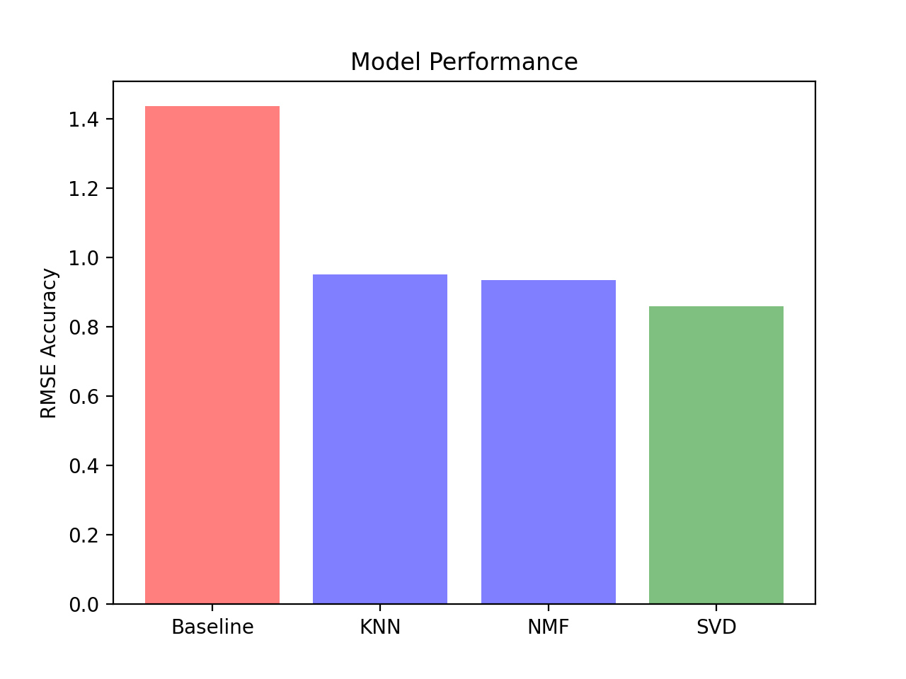

# Recomender System

 
### Authors

- Jawwad Siddiqui:
[LinkedIn](https://www.linkedin.com/in/jsiddiqui85/) |
[GitHub](https://github.com/jsiddiqui85) |
[Email](jsiddiqui85@gmail.com)
- Kyle Weesner:
[LinkedIn](https://www.linkedin.com/in/kyleweesner/) |
[GitHub](https://github.com/KyleWeesner) |
[Email](weesnerkew@yahoo.com)
- Nimeshi Fernando: 
[LinkedIn](https://www.linkedin.com/in/nimeshi-fernando2019/) |
[GitHub](https://github.com/nishlikefish) |
[Email](nimeshilfernando@gmail.com)
- Xiaohua Su: 
[LinkedIn](https://www.linkedin.com/in/xiaohua-su/) |
[GitHub](https://github.com/xiaohua-su) |
[Email](xiaohuasu99@gmail.com)
- Zachary Rauch: 
[LinkedIn](https://www.linkedin.com/in/zach-rauch/) |
[GitHub](https://github.com/ZachRauch)|
[Email](zach.rauch0@gmail.com)

---
## Overview

The aim of this project is to build a model that provides **top 5 movie recommendations** to a user, based on their **ratings of other movies** from Hulu. Our audience in this case is the **Hulu Technology Team** headed by the **CTO** of Hulu. They are holding a competition to upgrade their current machine learning algorithm that oversees the movie recommendations given to a Hulu subscriber. 

## Business Understanding and Stakeholder

Todays streaming landscape is vast and diverse, with over **1 billion users worldwide** and generating over **500 billion dollars** in revenue.  Hulu currently holds **14% of the market share** within the streaming industry, trailing behind **Netflix** with **25% of the market** **Amazon Prime Video** with **18%** **HBO Max** with **17%** and **Disney Plus** with * *14%* *.  It's also important to note that **85%** of **Hulu users** are also subscribed to **Netflix**  Currently, Hulu uses a * *item-based collaborative filtering algorithm* * this is a successful approach commonly used by many recommender systems. This type of recommender system takes into consideration the ratings given to movies and shows by users as the sole source of information for learning to make recommendations. 

Currently, Hulu is *losing their customer base* to their competitors **HBO Max**, **Prime Video**, and **Netflix** to name a few.  Although, Hulu *currently holds 14%* of the streaming market share - we want to ensure Hulu is able to **maintain** their subscriber-base by *increasing their user engagement* with their platform through *the implementation* of our improved recommendation system.

## Data and Methodology

The data was gathered from **GroupLens.org** where the information within this dataset is from **IMDB** and **TMDB**.  The rating and movie information was captured between the years of **1996 and 2018**.  

The dataset has over **100,000 movie ratings** given by **610 different users** for about **9700 movies**. Each user had reviewed *aleast* **20 different movies**.  However, due to time constraints, our model was built off of **100,000 movie ratings** versus the **1.9 million** ratings that were available in the original dataset.

**Surprise** was the main library we used to produce our *collaborative filtering model*.This library has endogenous methods of splitting our data set, cross validating, performing grid searches as well various different algorithms that can be used to build recommendation systems. 

As you go through this notebook, you will see that we had to use a combination of both surprise and **scikit-learn** methods to ensure the successful deployment of model. Since the syntax of surprise and sklearn are similar, this made this process much more efficient. This also ensures that the notebook would be readable to anyone with a background in *data science*. We mainly utilized surprise to transform the data set to a suitable data format that can be used in *recommendation systems*. We also employed **pickling** to make loading onto any new computer an easier process. 

## Methods

The first step in our **iterative modeling process** is to create and test a `dummy_model`, which will act as our **base line RSME (root mean squared error) score** that we compare to when judging the **validity** and **performance** of our future models.  

- Baseline model RMSE score is: **1.425**

We performed a `GridSearch` until the hyper-parameters were tuned to what is considered the **optimal amount**.

Next we used the **k-nearest neighbors (KNN) algorithm**, which is a *simple*, *supervised machine learning* algorithm that can be used to solve both *classification* and *regression* problems. In this case, we are using it as the basis for our recommendation system. The premise is that the rating of movies *unseen* by the user will be **predicted** using *ratings of similar users*. In this case, the nearest "neighbors".

- KNN model RMSE score is: **0.952**

After defining our `baseline_model` and exploring the `KNN` algorithm, we decided to try using `Singular Value Decomposition (SVD)` algorithm, in the hopes that it would improve the **accuracy** of our model and lower the **RSME**. The **surprise** library uses a form of `SVD` called **Funk's SVD**, the premise behind it is a **matrix factorization-based model**. This means it *transforms* a **user-item matrix** (in our case, a *user-movie ratings matrix*)into latent factor matrices. It is also important to note that errors are *minimized* using **stochastic gradient descent**.  This means that both `regularization` and `learning rate` are **hyper-parameters** that we can tune. Number of `factors` and number of `epochs` are also **hyper-parameters** we tuned.

- 'SVD model' RMSE score is: **0.861**

The **final algorithm** we explored in the surprise Library was `Non-negative Matrix Factorization (NMF)`. The only difference between this algorithm and the previous algorithm `SVD` is that in `NMF`, a specific *step size* is set for the stochastic gradient descent process of `regularization`. This is done to ensure that all **user** and **item factors** are kept positive. While this model can be prone to **over-fitting**, this can be mitigated with steps to **reduce the dimensionality** of our **data/factors**. 

- 'NMF Model' RMSE score is: **0.936**

When we compare the **best model** with *each different* algorithm explored, with hyper-parameters tuned to *optimize*, we found that our **best model** using `SVD` is the model which exhibits the *lowest* **RSME** in **cross validation**. Therefore that is the model we have determined to be our **final model**.

## Results


When we compare the **best model** with *each different* algorithm explored, with **hyper-parameters** tuned to *optimize*, we found that our **best model** using `SVD` is the model which exhibits the *lowest* **RSME** in **cross validation**. Therefore that is the model we have determined to be our **final model**.

## Recommendations 

Based on the *performance of our model* we recommend it can be used in the following ways: 

 1. Use our model to predict **rating of movies** that the user hasn't rated by looking at the **ratings** for those movies done by **similar users**.
 2. Use these **predicted ratings** as the basis for providing **recommendations** to users using the **app version** of our deployed recommendation system.
 3. Use the **app version** to filter based recommendations based on `genre`, including the movies that have *more than one* `genre` tied to it. 
 4. Use this as the basis to increase interest in films vs TV shows 

## Next Steps

1. Use more **current data** (our data set is from the 1996-2018), since tastes in movies and TV shows change so much over time, this would be a crucial next step in developing our *improving* our recommendation system model performance.

2. Use more **first party data** ( or dataset is from MovieLens), by using data native to Hulu we can gain a better understanding of the preferences of Hulu-specific users as opposed to users in general.

3. Use **more ratings**, we chose to use the smaller dataset in our analysis because of time constraints. We could have chosen to use the bigger set however we decided not to. This analysis should be re-done with more data.

4. Incorporate a **content based filtering algorithm** to address cold start problem

5. We would do **A/B testing** on the res system and subscriber retention

6. Build the second version of our app

## Repository Structure

```
├── Workspace  
│     ├── Jawwad
│     ├── Kyle
│     ├── Nish
│     ├── Xiaohua
│     └── Zach
├── data
├── images
├── .gitignore
├── LICENSE
├── README.md
├── Recommendation_System.ipynb
├── app.py
├── mac_streamlit.yml.yml
└── windows_streamlit.yml
```

## Citations:

Images:
- https://streamingwars.com/whats-leaving-hulu-this-week-from-50-first-dates-to-rambo/
- https://towardsdatascience.com/recommendation-system-series-part-1-an-executive-guide-to-building-recommendation-system-608f83e2630a
- https://www.statista.com/statistics/496011/usa-svod-to-tv-streaming-usage/#:~:text=According%20to%20a%20recent%20survey,entering%20the%20market%20last%20year

Code References:
- https://github.com/danielburdeno/Kindle-eBook-Recommendations
